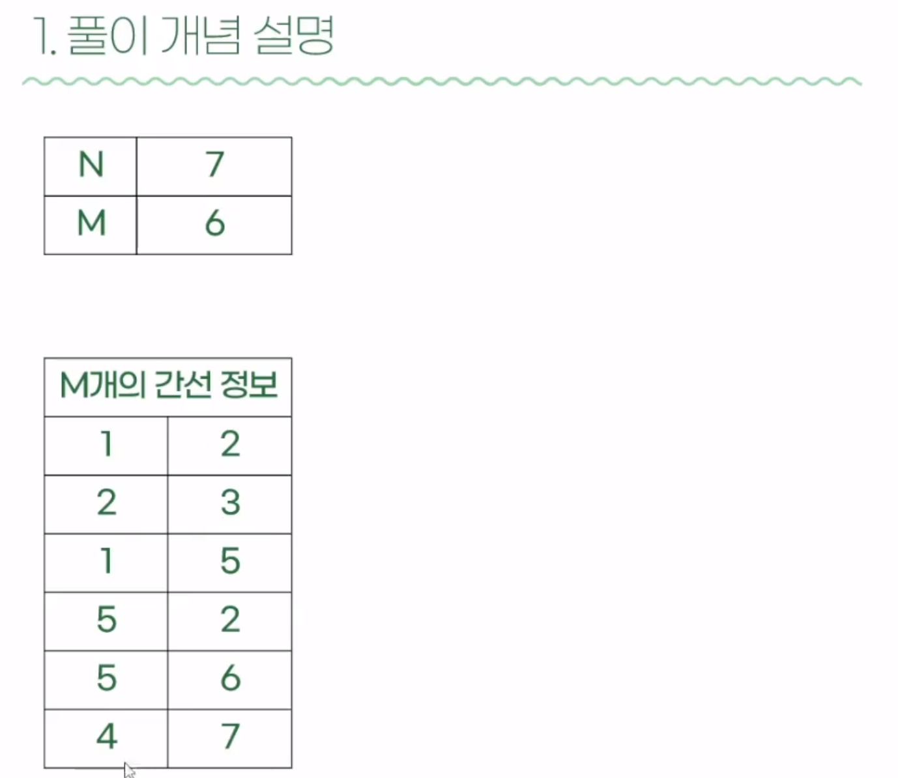

# 분석

- '연결'이라는 키워드와 '탐색' 나왔으니 dfs, bfs 써야겠다!

 
 

- 여기서 N은 컴퓨터의 개수, M은 간선의 개수 (사실 아직 뭔 상관인진 이해 안감)
- 그 뒤에는 M개의 간선 정보, ex. 1번과 2번이 연결되어 있다 등 ..
> 사실 이 것만 가지고 dfs 풀기는 엄청 어렵다. 그래서 '그래프' 개념이 필요하다.

  

- 자, 위 그래프를 보자. 2차원의 boolean 배열이 보이지 않는가?
> 그렇다 저 2차원의 boolean 배열이 바로 그래프다.

  

- 노드 1과 2는 서로 연결되어 있다. 그러면 그래프의 연결 정보를 위 그림처럼 설정해주어야 한다.
- `가장 먼저 해야 할 일이다. 연결 정보에 따라 2차원 배열인 그래프를 초기화 해주는 것.`

  

- 보이는가, 위 처럼 그래프에 연결 정보를 표시한다.
- 이제 visited 배열을 체크해 가면서 탐색을 진행하면 된다. 이 경우 dfs 탐색이니 아래 순서대로 진행해보자

> a. 시작하는 1번 노드는 그냥 바로 체크, visited 배열에 1번 체크. 

> b. 1 번 노드는 2번과 연결되어 있으니 2번 탐색, 그리고 visited에 2번 체크

> c. 2번에서 1번과 연결되어 있음을 확인했지만 이미 vistied에 있기에 건너 띄고 3번 노드 탐색

> d. 3번 노드엔 2번 밖에 없어서 패스

> e. 다시 밖으로 나와서 2번 노드와 연결되어 있던 5번 노드 탐색 및 체크

> f. 최종적인 visited 배열을 보면 연결 되어 있는 노드의 개수를 알 수 있다.

