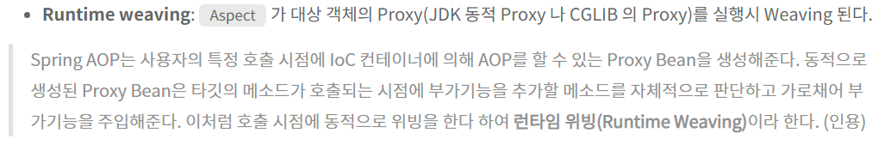
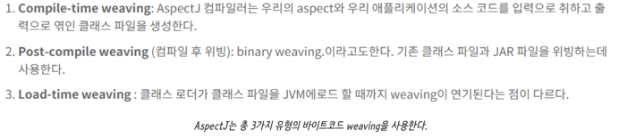

# 스프링의 AOP
___

> AOP는 비즈니스 로직과 재사용하면 좋은 중복 코드들을 분리하는 방법중에 하나입니다.

###### 스프링에선 @Aspect, @Around, @Advice등의 AOP 컨셉을 쉽게 적용하는 걸 돕는 애노테이션들을 지원받을 수 있습니다.

---- 

 

### 꼬리 질문1. 스프링에선 AOP를 어떻게 구현하나요?
> SPRING AOP와 ASPECT J를 이용해 구현할 수 있는데, 사실 둘은 긴밀하게 연관된 관계입니다. 일단 그냥 코드 보여드리겠습니다.
###### 

----

 

### 꼬리 질문2. SPRING AOP와 ASPECT J의 차이가 뭔가요? 
> 에스펙트 자바 클래스를 대상으로, SPRING AOP는 빈 기반이다. 라던지 위빙 시점이 다르다 같은게 있는데 그냥 제가 생각 할 때는 @Aspect 같은 거 이용하고 @EnableAspectJAutoProxy 적용하는 거 같이 AOP 컨셉을 구현하는데 AspectJ를 사용하고 실제 빈을 이용해 프록시 객체 생성하는 역할을 하는게 SpringAOP라고 이해했습니다.

###### SPRING AOP는 Spring Container에서 제공하는 간편한 AOP 기능입니다. 스프링 Bean 기반의 AOP이고, AspectJ는 자바 기반의 모든 객체에 대해 적용 가능한 프록시를 다루는 도구입니다. 

###### 

----

 

### 꼬리 질문3. SPRING AOP의 런타임 위빙에 대해서 설명해주실래요?
> @EnnableAspectJAutoProxy를 사용했다는 기준하에선, 해당 애노테이션을 적용한 Configuration 기반의 애플리케이션 컨텍스트가 생성 될 때 혹은 컴포넌트 스캔시에 프록시 객체들이 생성됩니다!

###### 프록시 생성을 원하는 객체를 스프링 빈에 등록해두고 스프링, 정확히는 ApplicationContext등을 이용해 해당 객체의 Aspect에서 pointCut으로 지정한 JoinPoint의 메서드의 advice에 정의된 코드를 해당 시점에 맞춰 삽입합니다. 

###### 

----

 

### 꼬리 질문3. 프록시 조작 시점들엔 어떤것들이 있는지 아세요?
> 프록시를 조작하는 방법은 시점에 따라 3가지로 나뉩니다. 컴파일, JVM 로드 시점 같은 런타임에 영향을 주지 않는 시점과 SPRING AOP가 사용하는 런타임 시점의 위빙이 그 예입니다.
###### 사실 `프록시를 이용해 객체를 조작할 수 있는 방법`은 [컴파일 시점, JVM의 클래스 로드 시점 , 런타임 시점] 으로 3가지인데 `SPRING AOP는` 런타임 시점에 동적으로 프록시 객체를 생성하는 `런타임 위빙`을 사용한다. 때문에 애플리케이션 성능에 영향을 끼칠 수 있는 반면 단순히 ASPECT J만 사용하는 방식은 `컴파일이나 JVM 로드 시점`에 위빙을 한다. (마이크 타이슨 위빙 아님)

##### [그림1]. 런타임위빙에 대해서
###### `위빙`이란 건 `프록시 객체를 언제 생성하냐는 얘기`인데, `런타임 위빙`이라고 하면 `애플리케이션 실행중에 프록시 객체를 생성`해서 만들어진 결과 코드를 기존 코드와 바꿔치기해서 전달한다는 의미이다. 그러다보니 이런 실행환경에서의 위빙은 `성능에 영향을 끼칠 수 있음을 기억`해야한다.

##### [그림2]. Aspect J가 지원하는 위빙
###### 런타임 위빙만 지원하는 스프링 AOP와 다르게 ASPECTJ는, 사실 SPRING AOP도 ASPECT J를 쓰지 않나? .. 

### @@ 여기 이상한 부분 체크!

----

